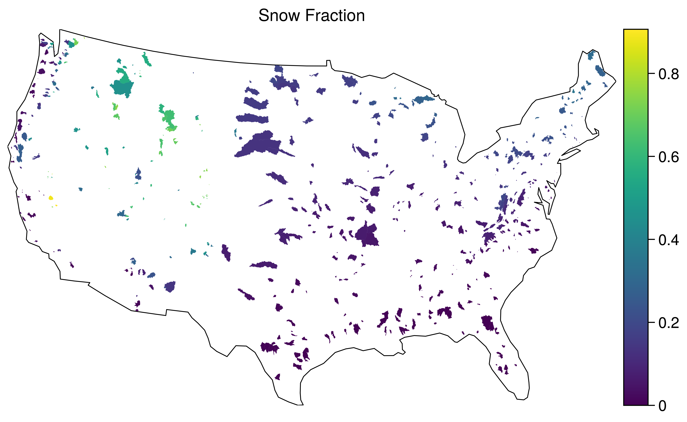
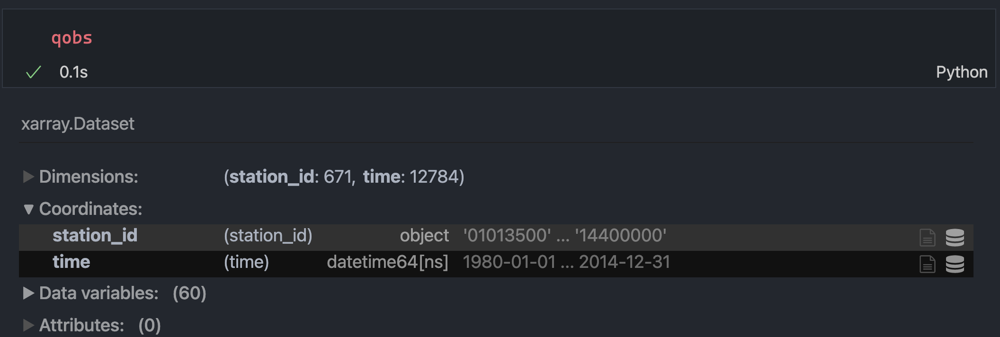
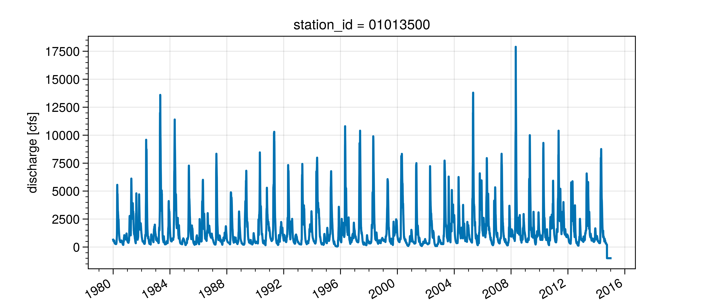

# CAMELS dataset in NetCDF/Feather formats

## Motivation

The [CAMELS](https://ral.ucar.edu/solutions/products/camels) datasets
are not provided in an ideal format and takes
a bit of data processing to convert them to useful and convenient
forms for geospatial analyses. So, I decided to use the beloved `netcdf` and `feather`
formats to make the dataset more accessible while taking care of some
small annoyances!

## Usage

First make sure that `h5netcdf`, `geopandas`, `xarray`, and `requests`
Python packages are installed, then load the files directly like so:

```python
import io

import geopandas as gpd
import requests
import xarray as xr

r = requests.get("https://media.githubusercontent.com/media/cheginit/camels_netcdf/main/camels_attributes_v2.0.feather")
attrs = gpd.read_feather(io.BytesIO(r.content))

r = requests.get("https://media.githubusercontent.com/media/cheginit/camels_netcdf/main/camels_attrs_v2_streamflow_v1p2.nc")
qobs = xr.open_dataset(io.BytesIO(r.content), engine="h5netcdf")
```

## Methodology

This repo contains the code that I used to generate the datasets.
Three data sources are available from the CAMELS dataset:

- [Observed Flow](https://ral.ucar.edu/sites/default/files/public/product-tool/camels-catchment-attributes-and-meteorology-for-large-sample-studies-dataset-downloads/basin_timeseries_v1p2_metForcing_obsFlow.zip):
  Streamflow observations for all 671 stations.
- [Basin Geometries](https://ral.ucar.edu/sites/default/files/public/product-tool/camels-catchment-attributes-and-meteorology-for-large-sample-studies-dataset-downloads/basin_set_full_res.zip):
  Polygons representing basins' boundaries for all 671 stations.
- [Basin Attributes](https://ral.ucar.edu/sites/default/files/public/product-tool/camels-catchment-attributes-and-meteorology-for-large-sample-studies-dataset-downloads/camels_attributes_v2.0.zip): 60 Basin-level attributes for all 671 stations.

The `camel_netcdf.py` generates two files:

- `camels_attributes_v2.0.feather`: Includes basin geometries and 60
  basin-level attributes that are available in CAMELS.
- `camels_attrs_v2_streamflow_v1p2.nc`: Includes observed flows
  for all 671 stations, as well as the 60 basin-level attributes. It has
  two dimensions (`station_id` and `time`) and 60 data variables.

Additionally, the script takes care of some small annoyances:

- Station names didn't have a consistent format and there were some missing
  commas and extra periods! Now, the names have a consistent format (`title`)
  and there is comma before the states.
- Station IDs and HUC 02 are strings with leading zeros if needed.

You can recreate the generated files locally using
[`mambaforge`](https://github.com/conda-forge/miniforge/) (or `conda`) like so:

```bash
git clone https://github.com/cheginit/camels_netcdf
cd camels_netcdf
mamba env create -f environment.yml
conda activate camels
chmod +x ./camels_netcdf.py
./camels_netcdf.py
```

## Example Plots

Snow fraction using `camels_attributes_v2.0.feather`:


The dataset `camels_attrs_v2_streamflow_v1p2.nc`:


Streamflow observations for USGS-01013500:


## Contributions

Contributions are welcome! Please feel free to open an issue/PR if you
have any suggestions that can improve the database.
